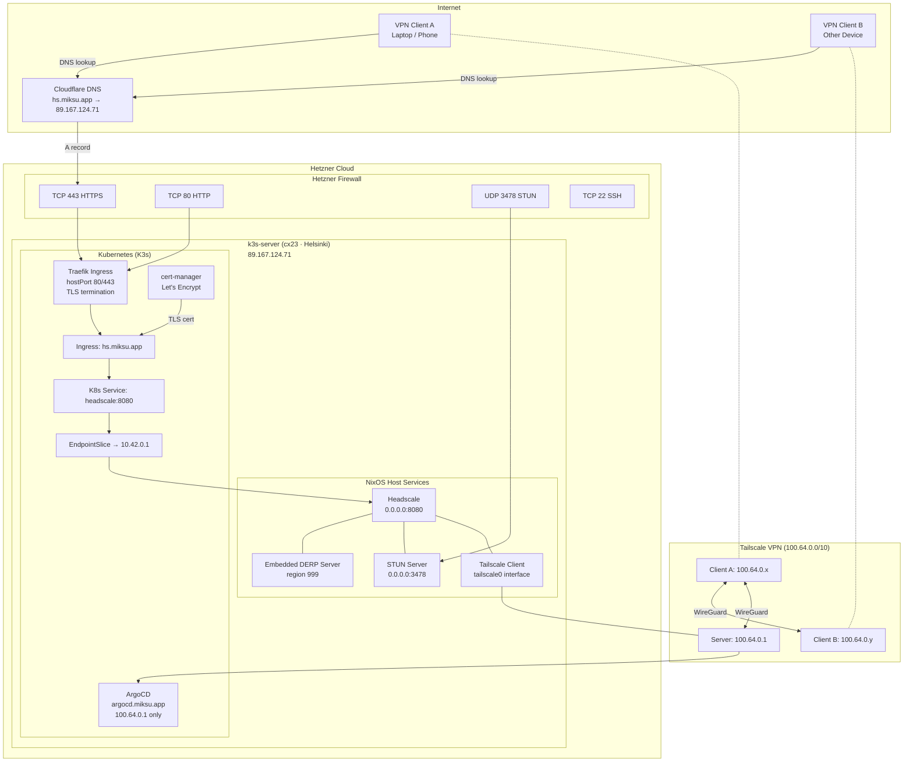
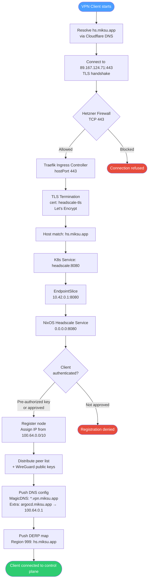
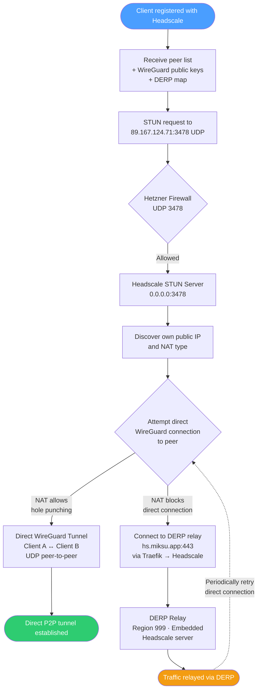

# Headscale Network Architecture

## Infrastructure Overview



## HTTPS Control Plane Flow

Client registration, key exchange, and coordination all happen over HTTPS.



## WireGuard Connection Flow

After control plane registration, clients establish WireGuard tunnels.



## Client-to-ArgoCD Access Flow

ArgoCD is only reachable through the Tailscale VPN (no public DNS record).

```mermaid
flowchart LR
    CLIENT[VPN Client] -->|Query argocd.miksu.app| TS_DNS[Tailscale DNS<br/>intercepted locally]
    TS_DNS -->|MagicDNS lookup| HS_DNS[Headscale DNS<br/>extra_records]
    HS_DNS -->|100.64.0.1| RESOLVE[Resolved to<br/>Tailscale IP]
    RESOLVE -->|WireGuard tunnel<br/>to 100.64.0.1| SERVER[K3s Server<br/>tailscale0 interface]
    SERVER -->|Local traffic| ARGOCD[ArgoCD<br/>Internal K8s service]

    style CLIENT fill:#4a9eff,color:#fff
    style ARGOCD fill:#2ecc71,color:#fff
```



## Network Layers Summary

```
┌─────────────────────────────────────────────────────────────────────┐
│                         PUBLIC INTERNET                             │
│  Clients ──DNS──▶ Cloudflare ──▶ 89.167.124.71                     │
├─────────────────────────────────────────────────────────────────────┤
│                      HETZNER FIREWALL                               │
│  TCP 22 (SSH) │ TCP 80/443 (HTTP/S) │ UDP 3478 (STUN)             │
├─────────────────────────────────────────────────────────────────────┤
│                     KUBERNETES (K3s)                                │
│  Traefik (hostPort) ──▶ Ingress ──▶ Service ──▶ EndpointSlice     │
│  cert-manager (Let's Encrypt TLS)                                  │
│  Pod CIDR: 10.42.0.0/16  │  Service CIDR: 10.43.0.0/16           │
├─────────────────────────────────────────────────────────────────────┤
│                      NixOS HOST                                     │
│  Headscale (0.0.0.0:8080)  │  DERP (embedded)  │  STUN (:3478)   │
│  Tailscale client (tailscale0, trustedInterface)                   │
├─────────────────────────────────────────────────────────────────────┤
│                    TAILSCALE VPN OVERLAY                            │
│  CGNAT: 100.64.0.0/10  │  IPv6: fd7a:115c:a1e0::/48              │
│  MagicDNS: *.vpn.miksu.app                                        │
│  Server: 100.64.0.1  │  Clients: 100.64.0.x                      │
│  ArgoCD reachable at argocd.miksu.app → 100.64.0.1                │
└─────────────────────────────────────────────────────────────────────┘
```

## Port Reference

| Port  | Protocol | Purpose                                                              | Source       |
| ----- | -------- | -------------------------------------------------------------------- | ------------ |
| 443   | TCP      | HTTPS — Traefik ingress, TLS termination, control plane + DERP relay | Public       |
| 80    | TCP      | HTTP — Redirected to HTTPS by Traefik                                | Public       |
| 3478  | UDP      | STUN — NAT discovery for WireGuard hole punching                     | Public       |
| 8080  | TCP      | Headscale HTTP — internal only, behind Traefik                       | K8s internal |
| 41641 | UDP      | WireGuard — direct peer-to-peer tunnels                              | Peer-to-peer |
